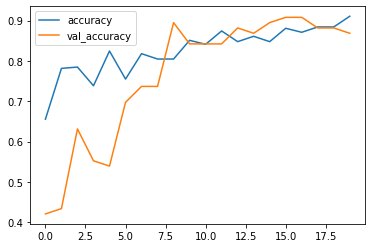
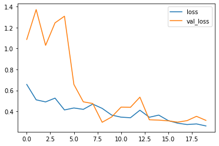
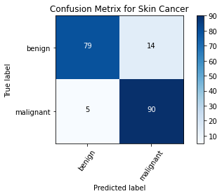
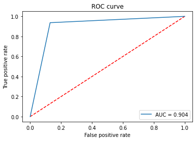

# Breast-cancer-classification
Breast Cancer Classification using Densnet201Model.

# Authors
•	Ujwal Nagulapalli
•	Jyothsna Aitipamula

# Softwares & Environments Required
•	Python 3.9
•	TensorFlow
•	Matplotlib
•	Scipy & Scikit-Learn
•	Keras
•	TQDM
•	Numpy
•	Pandas
•	Jupiter Notebook

# Installation
For setting the Environment in the new M1 MacBook we need to follow this URL.

For setting the Environment in Windows machines use the following the commands:
•	pip install numpy pandas scikit-image matplotlib scikit-learn keras
•	jupyter notebook

# Data
The dataset can be downloaded from here. This is a binary classification problem. I split the data into test and validation.
•	/Users/ Desktop/Breast Cancer/data/train/benign
•	/Users/Desktop/Breast Cancer/data/train/malignant
•	/User /Desktop/Breast Cancer/data/validation/benign
•	/Users/Desktop/Breast Cancer/data/validation/malignant

# Results

## Accuracy

## Loss

## Confusion Matrx

## ROC and AUC

